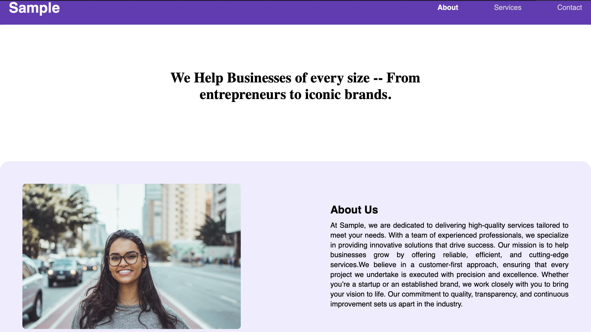
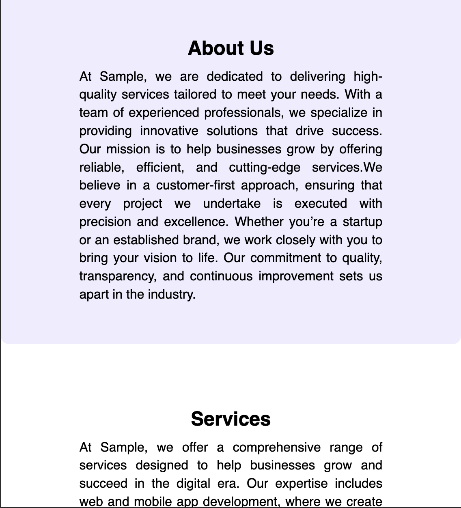

# 🌐 Static Webpage Layout

A single-page website built using **semantic HTML elements** and styled with **CSS**, including responsive design adjustments via media queries.

## 🚀 Features
- ✅ **Semantic HTML Structure** (`<header>`, `<nav>`, `<main>`, `<section>`, `<footer>`)
- 🎨 **CSS Styling for Typography & Colors**
- 📱 **Responsive Design for Mobile Compatibility**
- 📏 **Proper Spacing & Layout Adjustments**
- ⚡ **Navigation with Hover & Active States**

---

## 🏗️ HTML Tags Used
- **`<header>`**: Defines the website's header, including the title and introduction.  
- **`<nav>`**: Contains navigation links to different sections of the page.  
- **`<main>`**: Wraps the main content of the website.  
- **`<section>`**: Groups related content such as About, Services, and Contact.  
- **`<footer>`**: Displays copyright information at the bottom.  

---

## 🎨 CSS Styling Used
- **Typography**: Sets font styles, sizes, and colors for better readability.  
- **Layout**: Uses `margin`, `padding`, and `max-width` for spacing and alignment.  
- **Navigation Styling**: Styles navigation links and adds hover effects.  
- **Box Styling**: Adds `border-radius` and `box-shadow` for a modern look.  
- **Responsive Design**: Uses `@media` queries to adjust the layout for smaller screens.  

---

## 📷 Screenshots

### 🖥️ Desktop Preview  

### 📱 Mobile Preview  
  
  

---