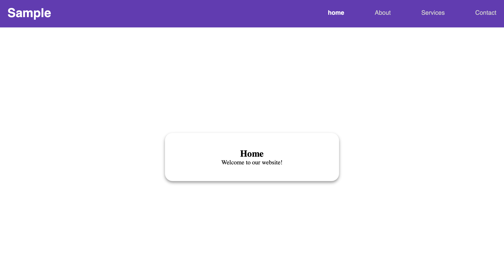
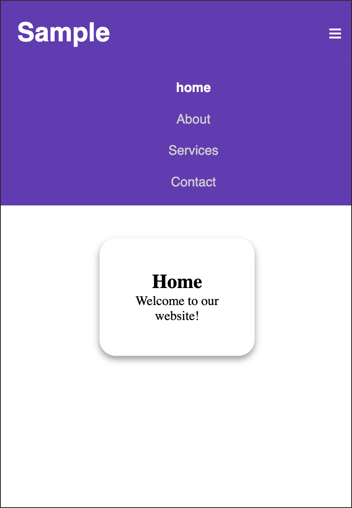

# 🎭 Interactive Multi-Page Website Simulator (CSS Only)  

A **fully functional multi-section website** that simulates navigating between different pages **without JavaScript**, using **CSS pseudo-classes** like `:target`. Smooth transitions and responsive design enhance the user experience.  

---

## 🚀 Features  
- ✅ **Pure CSS Multi-Page Navigation** (No JavaScript required)  
- 🎨 **Smooth Page Transitions with Animations**  
- 📌 **Uses `:target` Pseudo-Class for Page Switching**  
- 🔄 **Fully Responsive Across Devices (Desktop & Mobile)**  
- 🌐 **Accessible Navigation Menu with Mobile Support**  

---

## 🏗️ HTML Structure  
- **`<a href="#home">Home</a>`**: Navigation links direct to different sections.  
- **`<section id="home" class="page">`**: Each page is defined as a `section` with a unique ID.  
- **`:target` Selector** is used to **toggle visibility of different sections**.  
- **Navigation Menu** is designed for **desktop & mobile** views.  

---

## 🎨 CSS Styling Used  
- **Global Reset**: Ensures consistency across different browsers.  
- **Page Switching Behavior**:  
  - All sections (`.page`) are **hidden by default**.  
  - The **`:target` pseudo-class** makes the targeted section visible.  
- **Smooth Transitions**: Animated using `@keyframes` and `opacity` transitions.  
- **Responsive Menu**: Uses media queries to toggle mobile-friendly navigation.  

---

## 📱 Responsive Behavior  
- **Desktop**: Horizontal navigation with a fixed top bar.  
- **Mobile**: Collapsible menu with a toggle button (`☰`).  
- **Fluid Layout**: Adjusts to different screen sizes using **Flexbox & Grid**.  

---

## 📷 Screenshots  

### 🖥️ Desktop Preview  
  

### 📱 Mobile Preview  
  

---

## 🎯 How It Works  
1. Clicking a navigation link (`#about`, `#services`, etc.) updates the URL hash.  
2. The `:target` pseudo-class detects the hash and displays the corresponding section.  
3. CSS animations ensure smooth page transitions.  
4. The navigation menu adapts responsively for different screen sizes.  

---

## 🌟 Technologies Used  
- **HTML5** for structure  
- **CSS3** for styling, animations, and transitions  
- **Flexbox & Grid** for layout  
- **Pseudo-classes (`:target`, `:hover`)** for interactive behavior  

---

