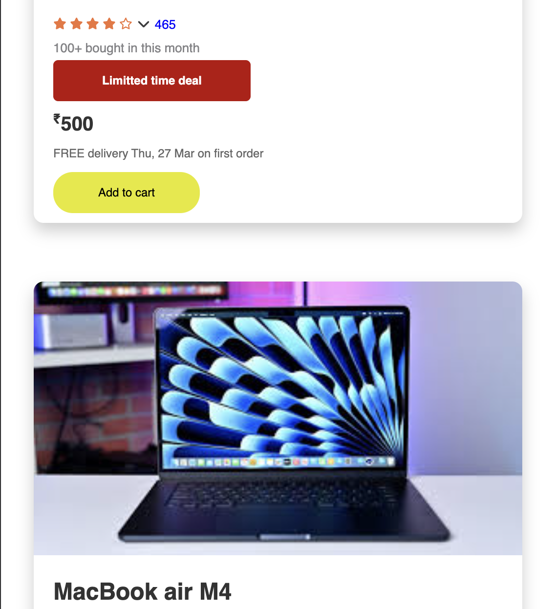

# 📐 Responsive Grid Layout with CSS Grid  

A **dynamic grid layout** that adjusts seamlessly between **desktop and mobile views**, ensuring a **consistent and user-friendly display** of multiple items.

---

## 🚀 Features  
- ✅ **CSS Grid-based Responsive Layout**  
- 💻 **Three-column layout for desktop screens**  
- 📱 **Single-column stacking for mobile screens using media queries**  
- 🎨 **Consistent spacing, alignment, and hover effects**  

---

## 🏗️ HTML Tags Used  
- **`
`**: Wraps the entire grid container.  
- **`
`**: Represents each item in the grid.  
- **``**: Displays the product image.  
- **`
`**: Holds the text content of each card.  
- **`<h2>`**: Displays the product title.  
- **`
`**: Contains star rating icons.  
- **`
`**: Styles the "Limited Time Deal" button.  
- **`
`**: Represents the "Add to Cart" button.  

---

## 🎨 CSS Styling Used  
- **CSS Grid Layout**: Uses `grid-template-columns` for **multi-column structure**.  
- **Responsive Design**: Utilizes **media queries** to switch layouts for different screen sizes.  
- **Card Styling**: Implements `border-radius`, `box-shadow`, and `padding` for an elegant design.  
- **Hover Effects**: Adds **smooth scaling** and **shadow enhancements** when hovering over a card.  
- **Typography & Buttons**: Ensures **readability** and well-defined **call-to-action buttons**.  

---

## 🖥️ Responsive Behavior  
- **Desktop (Width > 768px)**: Displays **three columns** with consistent spacing.  
- **Mobile (Width ≤ 768px)**: Stacks items in a **single column** for better readability.  

---

## 📷 Screenshots  

### 🖥️ Desktop Preview  
  

### 📱 Mobile Preview  
  

---