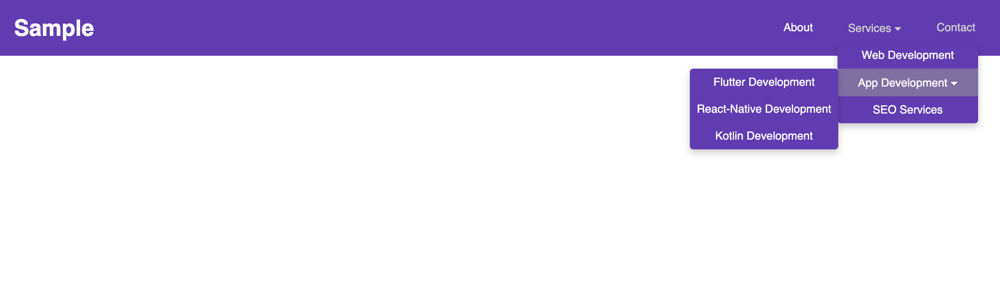

# 🎨 Pure CSS Dropdown Menu  

A **responsive navigation bar** with a **smooth dropdown submenu**, built using **only HTML and CSS**. The menu reveals submenus on hover and includes a **mobile-friendly toggle button**.

---

## 🚀 Features  
- ✅ **Pure CSS Dropdown with Hover Effects**  
- 🖥️ **Desktop & Mobile Compatible**  
- 🎨 **Smooth Reveal Transition for Submenus**  
- 📱 **Responsive Design with a Mobile-Friendly Toggle**  

---

## 🏗️ HTML Structure  
- **`<header class="topnav">`**: Contains the navigation bar.  
- **`<nav>`**: Wraps the navigation links.  
- **`<ul class="navbar">`**: Represents the main navigation menu.  
- **`<li class="dropdown">`**: Defines dropdown menu items.  
- **`<ul class="dropdown-menu">`**: Holds submenu items.  
- **`<button class="menu-toggle">`**: Toggles the menu on mobile.  

---

## 🎨 CSS Styling Used  
- **Global Reset**: Removes default margins and paddings.  
- **Navigation Bar**: Uses `flexbox` for alignment and spacing.  
- **Dropdown Menu**:  
  - **Hidden by default** and revealed on `:hover`.  
  - **Smooth transition** using `opacity` and `transform`.  
- **Nested Dropdown**: Supports multi-level submenus.  
- **Responsive Design**: Uses **media queries** for mobile support.  

---

## 📱 Responsive Behavior  
- **Desktop**: Dropdown menus appear **on hover**.  
- **Mobile**: Navigation menu becomes a **vertical list**, toggled by a button.  

---

## 📷 Screenshots  

### 🖥️ Desktop Preview  
  

### 📱 Mobile Preview  
  

---