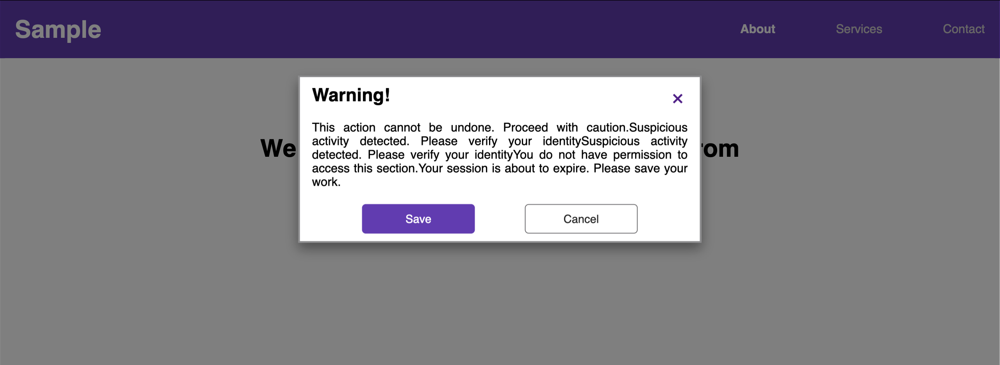

# 🎭 Modal Popup Using `:target` or Checkbox Hack  

A **fully functional modal popup** that opens and closes **without JavaScript**, using only **CSS pseudo-classes** like `:target`. The modal is designed to appear with a **smooth transition effect** and includes a **backdrop overlay**.

---

## 🚀 Features  
- ✅ **Pure CSS Modal Popup** (No JavaScript required)  
- 🎨 **Smooth Appearance & Disappearance with CSS Transitions**  
- 🖥️ **Fully Responsive Design (Desktop & Mobile Compatible)**  
- 🔄 **Backdrop Overlay for Better Focus**  

---

## 🏗️ HTML Structure  
- **`<header class="topnav">`**: Navigation bar at the top.  
- **`<button class="open-modal">`**: Button to **trigger the modal**.  
- **`
`**: The **modal popup** container.  
- **`<button class="close"><a href="#">&times;</a></button>`**: **Close button** inside the modal.  
- **`:target` Selector** is used to **show and hide** the modal.  

---

## 🎨 CSS Styling Used  
- **Global Reset**: Ensures consistency across different browsers.  
- **Modal Design**:  
  - **Initially hidden** (`opacity: 0` & `pointer-events: none`).  
  - **Displayed when targeted** using `:target`.  
  - **Smooth scale transition** for appearance/disappearance.  
- **Backdrop Overlay**: Adds a **semi-transparent background** when the modal is active.  
- **Buttons**: Styled with colors, padding, and hover effects.  

---

## 📱 Responsive Behavior  
- **Desktop**: The modal appears in the center with a **scale-in effect**.  
- **Mobile**: Modal content adapts for **smaller screens**.  

---

## 📷 Screenshots  

### 🖥️ Desktop Preview  
  

---