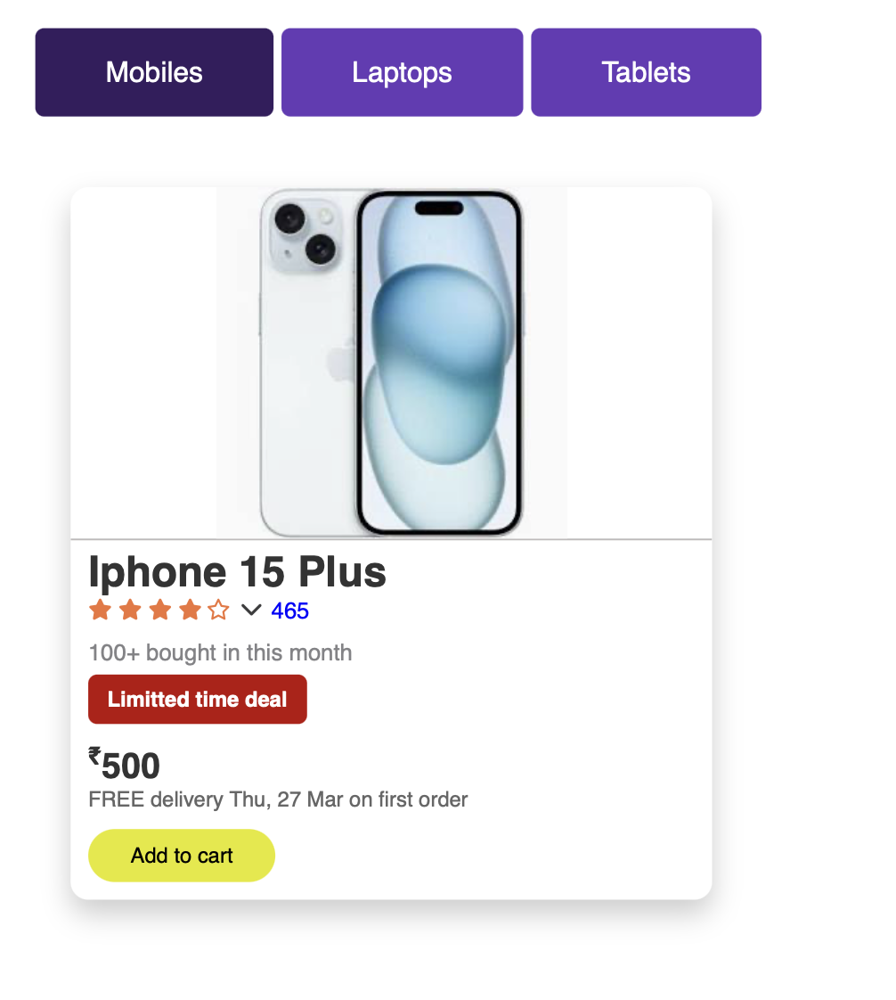

# 📌 Tabbed Content Interface (Pure CSS)  

A **fully functional tabbed interface** that dynamically displays different content **without JavaScript**, using **CSS pseudo-classes** like `:checked`. The transition effects ensure a smooth user experience.  

---

## 🚀 Features  
- ✅ **Pure CSS Tabs** (No JavaScript required)  
- 🎨 **Smooth Transitions between Tabs**  
- 🔘 **Uses Radio Buttons (Hidden) + Labels as Tabs**  
- 📱 **Fully Responsive Design (Works on Mobile & Desktop)**  

---

## 🏗️ HTML Structure  
- **`<input type="radio" id="tab1" name="tabs" checked>`**: Hidden radio buttons to control tab selection.  
- **`<label for="tab1" class="tab-label">`**: Labels act as **clickable tabs**.  
- **`
`**: Content sections for each tab.  
- **`:checked` Selector** is used to **display the selected tab content**.  

---

## 🎨 CSS Styling Used  
- **Global Reset**: Ensures consistent layout across browsers.  
- **Tab Styling**:  
  - Tabs are **styled as buttons** using `label`.  
  - Active tab changes color when selected (`:checked`).  
- **Smooth Transitions**: Content fades in using `@keyframes fadeIn`.  
- **Responsive Design**: Adapts to different screen sizes.  

---

## 📱 Responsive Behavior  
- **Desktop**: Tabs appear in a horizontal layout.  
- **Mobile**: Tabs stack vertically for better usability.  

---

## 📷 Screenshots  

### 🖥️ Desktop Preview  
  
  

---