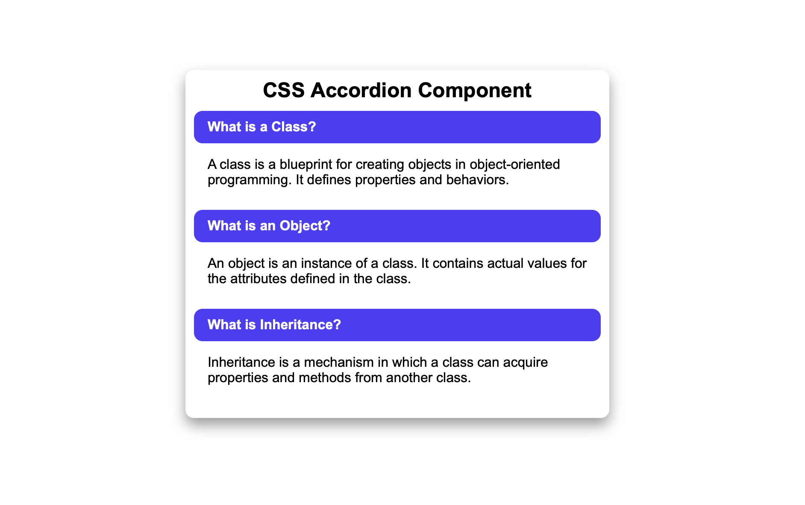

# 🎭 CSS Accordion Component  

A **fully functional accordion component** that expands and collapses **without JavaScript**, using **CSS pseudo-classes** like `:checked`. The accordion sections smoothly transition when opened and closed.  

---

## 🚀 Features  
- ✅ **Pure CSS Accordion** (No JavaScript required)  
- 🎨 **Smooth Expanding & Collapsing Transitions**  
- 📌 **Checkbox Hack for Open/Close Control**  
- 🔄 **Allows Multiple or Single Section Expansion**  
- 📱 **Fully Responsive Design (Works on Mobile & Desktop)**  

---

## 🏗️ HTML Structure  
- **`<input type="checkbox" id="sec1">`**: Hidden checkbox controls for toggling sections.  
- **`<label for="sec1" class="sec-title">`**: Labels act as **clickable headers** for each section.  
- **`
`**: Accordion content that expands/collapses.  
- **`:checked` Selector** is used to **toggle visibility of the content**.  

---

## 🎨 CSS Styling Used  
- **Global Reset**: Ensures consistency across different browsers.  
- **Accordion Behavior**:  
  - Sections are **collapsed by default**.  
  - **Expands when checked** using `input:checked + label + .sec-content`.  
- **Smooth Transitions**: Animated using `max-height` and `padding`.  
- **Hover Effects**: Headers change color on hover.  

---

## 📱 Responsive Behavior  
- **Desktop**: Sections remain compact and expand on click.  
- **Mobile**: Adapts to different screen sizes for readability.  

---

## 📷 Screenshots  

### 🖥️ Desktop Preview  
  

---