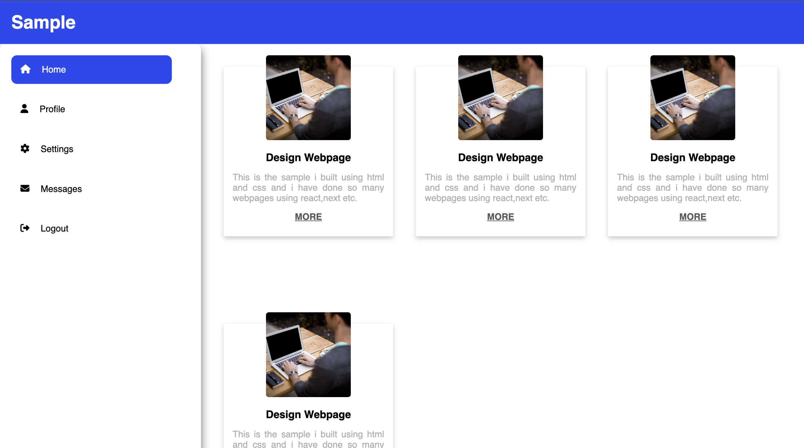
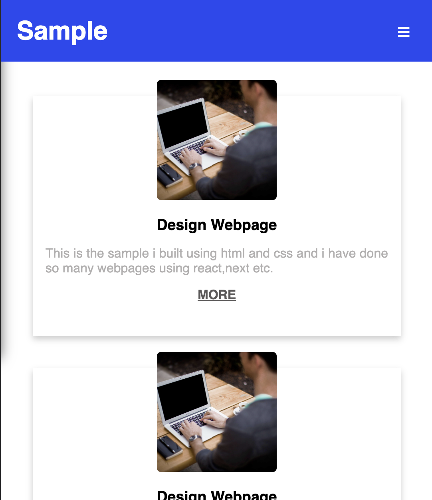

# 🏗️ Complex Responsive Layout with Grid and Flexbox

A **fully responsive webpage layout** built using a combination of **CSS Grid and Flexbox**. This layout features a **sticky header, a collapsible sidebar, overlapping elements, and dynamic content arrangement** based on the viewport size.

---

## 🚀 Features
- ✅ **CSS Grid for Main Layout Structure**
- ✅ **Flexbox for Inner Element Alignment & Spacing**
- 📌 **Sticky Header & Sidebar for Enhanced UX**
- 🔄 **Dynamic Reordering Based on Screen Size**
- 🎨 **Overlapping Elements Using z-index & Positioning**
- 📱 **Fully Responsive Design (Mobile & Desktop)**

---

## 🏗️ HTML Structure
- **<header class="topnav">**: Sticky top navigation bar with a **menu toggle button**.
- **<aside class="sidebar">**: Sidebar containing navigation buttons.
- **
**: Grid container that holds the sidebar and main content.
- **
**: Flexbox-based content section with multiple **cards**.
- **
**: Decorative overlapping element inside each card.

---

## 🎨 CSS Styling Used
### 🔹 Global Styles
- **Box-sizing reset** for consistent layout behavior.
- **Smooth transitions** applied for sidebar and content animations.

### 🔹 Grid & Flexbox Layout
- **CSS Grid** structures the main layout (`grid-template-columns: 1fr 3fr`).
- **Flexbox** is used within `.content` to handle card positioning and spacing.
- **Cards adapt** to different screen sizes with `flex-wrap: wrap`.

### 🔹 Sticky Elements
- **Sticky Header** (`position: sticky; top: 0;`) ensures navigation remains visible.
- **Sidebar is collapsible** on smaller screens using JavaScript toggling.

### 🔹 Overlapping Elements
- **z-index & absolute positioning** create visually appealing **floating elements**.

---

## 📱 Responsive Behavior
- **Desktop View**: Sidebar is always visible, and content is arranged in a **grid-based** layout.
- **Tablet/Mobile View**:
  - Sidebar **collapses** and appears on menu toggle.
  - Cards **stack vertically** for better readability.
  - Content adjusts dynamically using `media queries`.

---

## 🎬 Screenshots

### 🖥️ Desktop Preview

### 📱 Mobile Preview

